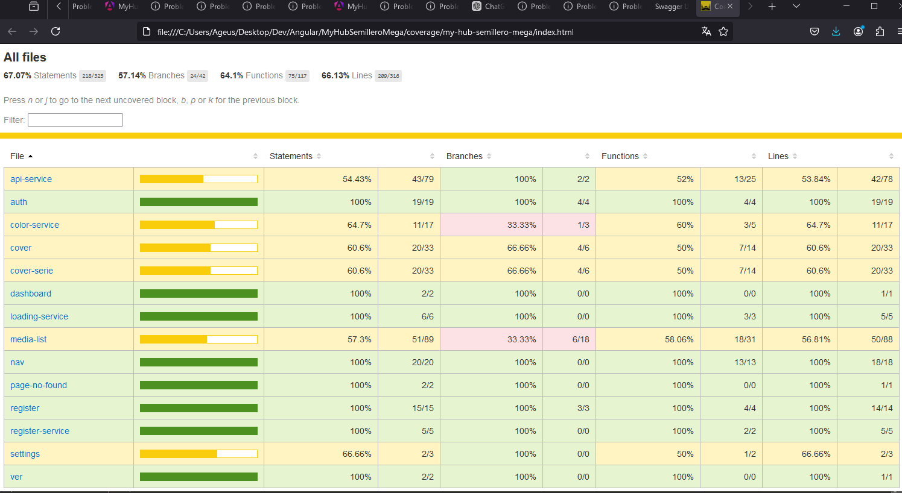
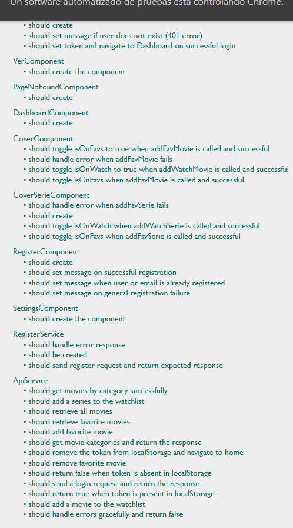

# SPRINT 6 - HUB DE ENTRETENIMIENTO - MY HUB - Kubernetes c#

* Nombre del proyecto - MYHUB
* Nombre del desarrollador: Agustín Aguilar Eusebio
* Usuario de discord: ageus94

### Descripción
Todos conocemos el ambiente de desarrollo, donde, desde que comenzamos a programar, desarrollamos aplicaciones en nuestra propia máquina. Sin embargo, este enfoque tiene sus limitaciones. Por ejemplo, la capacidad de carga que puede soportar es limitada, las configuraciones pueden no ser adecuadas para otros entornos y, sobre todo, la escalabilidad es restringida. A medida que nuestra aplicación crece, no basta con tener una sola copia en nuestro host local. Si la aplicación se vuelve exitosamente grande, necesitará un soporte adecuado para manejar la carga de trabajo.

Para abordar estos desafíos, es fundamental aprender a utilizar herramientas como Docker y Kubernetes. Estas tecnologías nos permiten:

- Escalabilidad: Aseguran que la aplicación pueda manejar un aumento en la carga de trabajo mediante la creación de múltiples instancias y el balanceo de carga.
- Consistencia: Garantizan que la configuración de la aplicación sea coherente en diferentes entornos, desde desarrollo hasta producción.
- Automatización: Facilitan la automatización del despliegue, gestión y orquestación de aplicaciones, reduciendo la intervención manual y los errores.

### Objetivo
- De la aplicacion que teniamos, generar los archivos que lleven nuestra aplicacion a un ambiente productivo

### Capturas
Mis pods que creé en mis deployments

El pod con el servicio

Docker

Mi front corriendo desde un servicio de kubernetes

### Instrucciones de uso
- Tener instalado docker
- Instalar minikube
- Cambiar todas las uris de la api por http://localhost:5000 en el proyecto de angular
- Hacer ng build
- Desde la ruta raiz, usar `docker-compose up`
- Cargar la imagen a minikube con `minikube image load front`
- Crear los pods y servicios del front con `kubectl apply -f yamls/front-dep.yaml` y  `kubectl apply -f yamls/front-service.yaml`
- Ya desde el servicio se puede ver que funciona
- Cambiar del proyecto front al back con cd api-aspnet
- correr dotnet publish -c Release -o out
- correr dotnet out/MovieHubApi.dll
- construir imagen
- Cargar la imagen a minikube con `minikube image load backend`
- Crear los pods y servicios del back con `kubectl apply -f yamls/front-dep.yaml` y  `kubectl apply -f yamls/front-service.yaml`
- Correr kubectl apply -f yamls/secret.yaml

### Dependencias o bibliotecas
- Docker v4.33.1
- Minikube 
- dotnet/sdk:8
- Angular v18
- Entity fremework 8.0.8
- AspNetCore.Cors 2.2.0
- Microsoft.EntityFrameworkCore.SqlServer 8.0.8
- Microsoft.AspNetCore.Authentication.JwtBearer 8.0.8
- JWT 10.1.1
- Node 20.15.0
- Sql Server 2022

### Descripción del proceso
Para empezar tuve que pasar toda la api de node express a c#, además de implementar una que otra cosa diferente tanto en el frontend como en el backend para que funcionara y a parte hacer el test de eso.

Después intenté hacer una imagen por frontend y por backend, sí pude después de un rato con el frontend, pero no con el backend, aunque si creaba los pods y los servicios, a la hora de probar me salía una página de error.

### Problemas conocidos
- No supe como hacer el deploy de la api con kubernetes, no supe como hacer el servicio para que funcionara con la base de datos porque supongo que debía desplegar una base de datos, y aunque la despliego no encuentro la correcta configuración para que tanto backend, base de datos y frontend funciones en conjunto desde kubernetes

### Codecoverage

### Test report

### Diagrama entidad relacion

### Posibles mejoras futuras
- Cerrar el menu cuando seleciono una categoria
- Consumir un servicio donde se descarge por streaming el video de la pelicula o capítulo
- Tener mas imagenes
- Seccionar mejor los listados de las peliculas
- Usar pafinación
- Más elementos animados y asíncronos

### Documentacion Api swagger
Swagger part1

Swagger part2

### Archivos de configuracion
Estan en la carpeta de yamls y api-aspnet/yamls

### Retrospectiva
### ¿Qué hice bien?
Configurar e instalar las cosas para que kubernetes funcionara

### ¿Qué no hice bien?
No encontrar la correcta configuracion para desplegar la base de datos con la api en modo de producción

### ¿Qué podría mejorar?
Aprender a configurar el backend con base de datos para kubernetes, separar los proyectos, no confiarme tanto de que es fácil hacer un deploy.
Me confié de que era sencillo desplegar mi aplicación y que no habría mucho que hacer.
